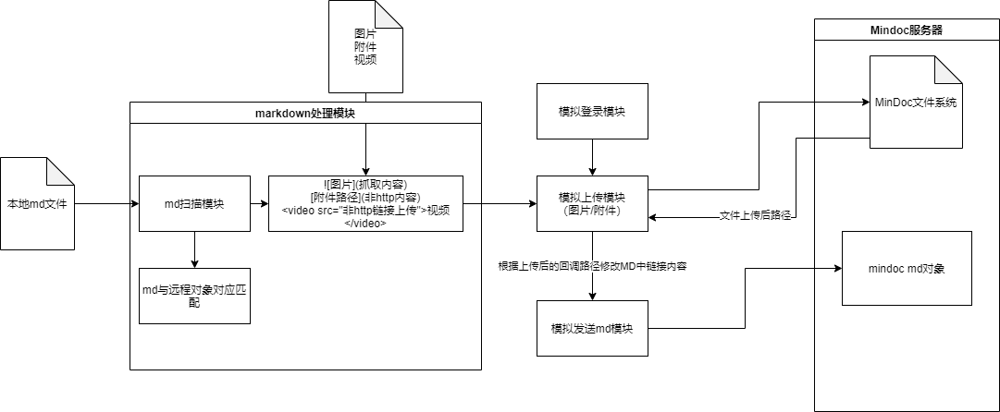

# 1. 需求说明
我们的Mindoc文档系统有一个很麻烦的事，就是如果在本地对Markdown文件进行编辑，那么在上传到MinDoc时会十分的痛苦，需要很多手动的事如：
1. 手动上传图片
2. 手动上传附件
3. 手动上传视频
4. 手动修改附件链接

# 2. 整体设计


# 3. 配置项
本项目主要使用config.ini进行配置，配置项如下，会存储在`~/.easy_mindoc/config.ini`下
```ini
[user]
cookie=[你的cookie]
```

# 4. 项目动向
被干掉了，它，仅存在了短短两小时
> 虽然被干掉了但是还是写出来了。。。

# 5. 搭建快速使用原型
## mindoc.py
用于发送请求，上传图片的

# 6. TODO
- [x] 写入配置文件
- [ ] 重新设计指令, 做成类似 git pull xxxxxx 类型的指令

